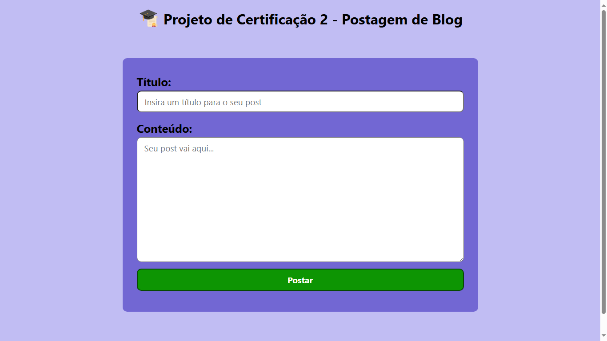

# Projeto Postagem de Blog 👨‍💻

## 💬 Descrição:

Projeto desenvolvido para obtenção do certificado de conclusão da Trilha 2 do curso DevStart Senai (Trilha 2. HTML, CSS e JavaScript). Trata-se de uma página web que contém um input para titulo e outro para escrever um conteúdo, simulando a criação de um post semelhante ao facebook, linkedIn, etc...; onde daremos um título, e escreveremos um texto qualquer e postamos. Nesse projeto fazemos uma comunicação com uma API aberta. Simulando um pouco do mundo real.

## 💻🖥️ Instruções de Instalação:

Trata-se de um projeto simples. Logo, não há instruções específicas de instalação. Basta copiar os arquivos e pastas para um diretório de sua preferência e abrir o arquivo "index.html" diretamente no navegador.

## ⌨️ Instruções de Uso

O projeto contém três pastas: css, img e js; contendo seus arquivos relacionados ao conteúdo de cada pasta; e um arquivo index.html. Para funcionar corretamente, tanto as pastas quanto o arquivo "index" devem estar dentro do mesmo diretório, pois as pastas são referenciadas pelo documento ".html". Abaixo uma imagem da página em tela cheia:

## 📃 Licença

## 🌏 Contribuições:

Como se trata de um projeto cujo objetivo é o aprendizado, aceito quaisquer contribuições que possam me acrescentar mais conhecimento. Desde já agradeço a todos que dispensarem um pouco de seu tempo para avaliar meu projeto. 😉

